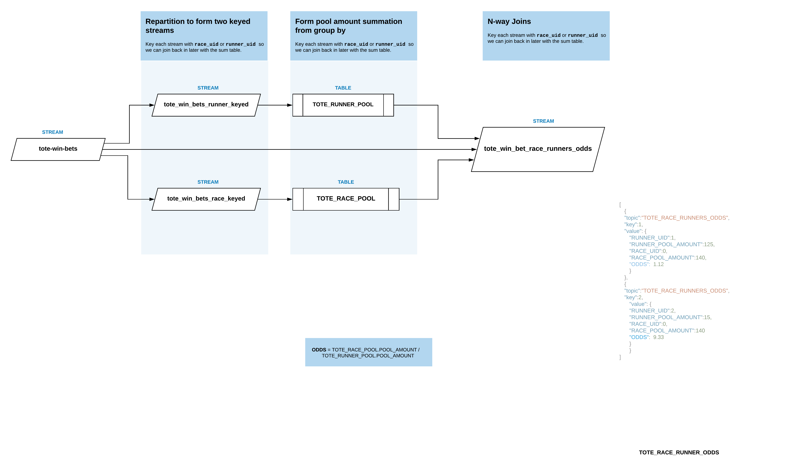

# Tote pool poc

Eventsource pattern used to form a tote pool. 

The main input topic `tote_win_bets` is keyed into two new streams which are used to form pools based around that key.

`tote_win_bets_runner_keyed` -> `tote_runners_pool`

`tote_win_bets_race_keyed` -> `tote_race_pool`

Then a N-way join on the intial unpartitioned streamd and the two pool tables to form the totes odds stream.

`tote_win_bets` | `tote_runners_pool` | `tote_race_pool` -> `tote_win_bet_race_runners_odds`


### Diagram



### Considerations;
* The two pool tables don't broadcast changes down stream, there is a eventual consistence concept at play.  
* The updates to the `tote_win_bets` seem to be behind one step, this doesn't effect the results, it is mearly how table and stream joins work - so the order of events will resolve. 
* Close off each race and runner zero amount bet to step the final stream foward and make it complete. As show below or via kssqldb cli;

```
{
      "topic": "tote_win_bets",
      "key": null,
      "value": {
        "runner_id": 1,
        "race_id": 0,
        "amount": 0
      }
    }
 ```   

### Prerequisites
* Docker desktop, best way to run Docker locally. The install bash has a brew for docker but you will still need the Docker for Desktop for the engine: https://www.docker.com/products/docker-desktop/


### Install and run
1. `bash install.sh`
To install any missing dependencies. Including makefile.

2. `make start`
To run the docker containers.

3. `make build` | `bash build.sh`
To build the streams and tables, the makefile has the permissions added.

4. `make cli`
To start the ksqlDB CLI. Open a new terminal window for this. 

Once you have build the streams and tables a nice way of running a demo is to run a pull query in `ksqldb-cli` on the final stream `tote_win_bet_race_runners_odds` like;

`SELECT * FROM tote_win_bet_race_runners_odds WHERE race_id = 0 EMIT CHANGES;` 

This will continously print to console changes to that stream.

5. Sending bets using the REST Proxy. The bash script below requires the schema id. If you start from scratch it should be `1`. 

`bash post_bets.sh`
Use this to insert a couple of bets into `tote_win_bets`.

`bash post_bets_large.sh`
Use this to insert an array of bets into `tote_win_bets`.

**Problem Shooting:** Run `bash utilities/schema_query.sh` to get the schema_value id and edit the above bash scripts.


### Kill, prune and clear the caontainers 

`make kill`
To kill the running docker

`make prune`
To remove any instances and volumes, good for clearing streams or if you have made structural changes during development.


### Useful queries

`SHOW STREAMS;`
`SHOW TABLES;` | `LIST TABLE;`
`SHOW queries;`
`DESCRIBE table | stream;`
Details of that steam or table, including type of data.

`PRINT 'topic' FROM BEGINNING INTERVAL 1;`
A way of seeing the output.

`DROP TABLE table_name;` 
`DROP STREAM table_name;` 
You will need to terminate any querys creating the table first;

`TERMINATE query_id;` 

